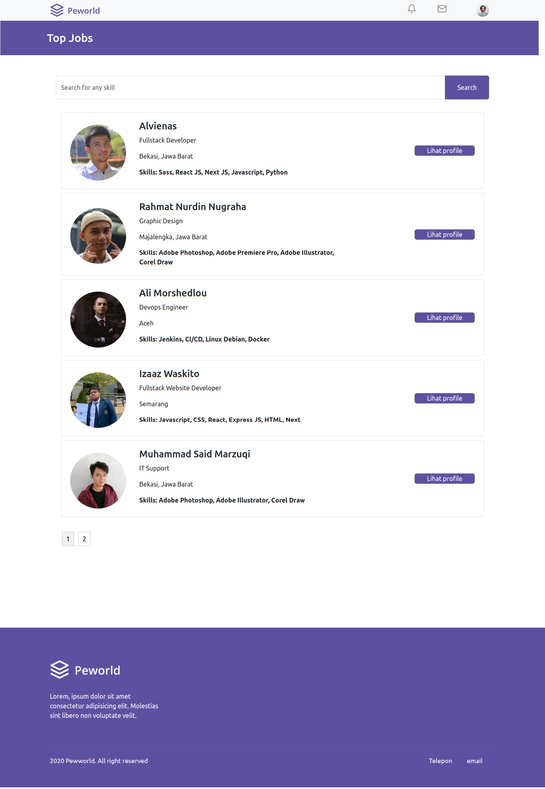
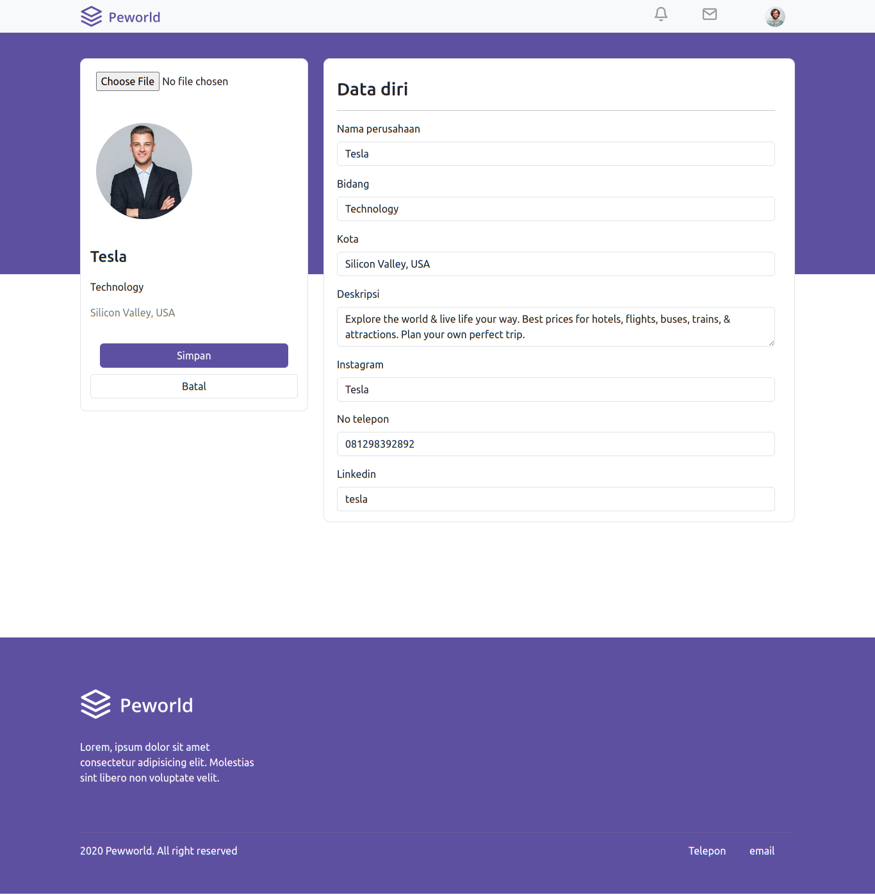

<br />
<p align="center">
  <div align="center">
    
  </div>
  <h3 align="center">Peworld Hire Job</h3>
  <p align="center">
    <a href="https://github.com/vineas/hire-job_backend"><strong>Explore the docs »</strong></a>
    <br />
    <a href="https://hire-job-frontend.vercel.app">View Demo</a>
    ·
    <a href="http://hire-job-backend.vercel.app">Api Demo</a>
  </p>
</p>


## Table of Contents

- [Table of Contents](#table-of-contents)
- [About The Project](#about-the-project)
  - [Built With](#built-with)
- [Installation](#installation)
  - [Documentation](#documentation)
  - [Related Project](#related-project)
- [Contributors](#contributors)
  - [Meet The Team Members](#meet-the-team-members)

  # About The Project

Hire Job is an innovative application designed to facilitate the interaction between two main types of users: job seekers and recruiters. This application provides an efficient solution in the world of recruitment with a focus on developing job seeker profiles and enabling recruiters to find candidates that match their company's needs.


## Built With

These are the libraries and service used for building this backend API

- [ReactJS](https://react.dev/)
- [Bootstrap](https://getbootstrap.com/)
- [React-icons](https://react-icons.github.io/react-icons/)
- [Axios](https://axios-http.com)
- [Sweetalert2](https://sweetalert2.github.io)

# Getting Started

## Prerequisites

You'll need these programs installed before proceeding to installation

- [Git](https://git-scm.com/downloads)
- [Node.js](https://nodejs.org/en/download)

This project requires [hirejob-backend](https://github.com/vineas/hire-job_backend/) to function properly, follow the steps provided in the readme to install and run the backend API


## Installation

Follow this steps to run the server locally

1. Clone this repository

```sh
git clone https://github.com/vineas/hire-job_frontend
```

2. Change directory to hire-job_frontend

```sh
cd hire-job_frontend
```

3. Install all of the required modules

```sh
npm install
```

4. Create and configure `.env.local` file in the root directory, example env are provided in [.env.local.example](./.env.local.example)

```env
NEXT_PUBLIC_API_URL=[ Backend URL ]
```

5. Run this command to run the server in development environment

```sh
npm run start
```

- Run this command to build this website into production ready

```sh
npm run build
```


# Screenshots

<table>
 <tr>
    <td></td>
    <td></td>
  </tr>
  <tr>
    <td>Login Worker</td>
    <td>Register Worker</td>
  </tr>
   <tr>
    <td></td>
    <td></td>
  </tr>
  <tr>
    <td>Login Recruiter</td>
    <td>Register Recruiter</td>
  </tr>
  <tr>
    <td></td>
    <td> </td>
  </tr>
   <tr>
    <td>Home Page</td>
    <td>Edit Worker Profile</td>
  </tr>
  <tr>
    <td></td>
    <td> </td>
  </tr>
   <tr>
    <td>Profile Worker</td>
    <td>Top Jobs</td>
  </tr>
    <tr>
    <td> </td>
    <td></td>
  </tr>
   <tr>
    <td>Profile Worker Hire</td>
    <td>Hiring Worker</td>
  </tr>
    <tr>
    <td></td>
    <td> </td>
  </tr>
   <tr>
    <td>Profile Recruiter</td>
    <td>Edit Profile Recruiter</td>
  </tr>
    
</table>

## Related Project

:rocket: [`Backend Hirejob`](https://github.com/vineas/hire-job_backend)

:rocket: [`Frontend Hirejob`](https://github.com/vineas/hire-job_frontend)

:rocket: [`Demo Hirejob`](https://hire-job-frontend.vercel.app)